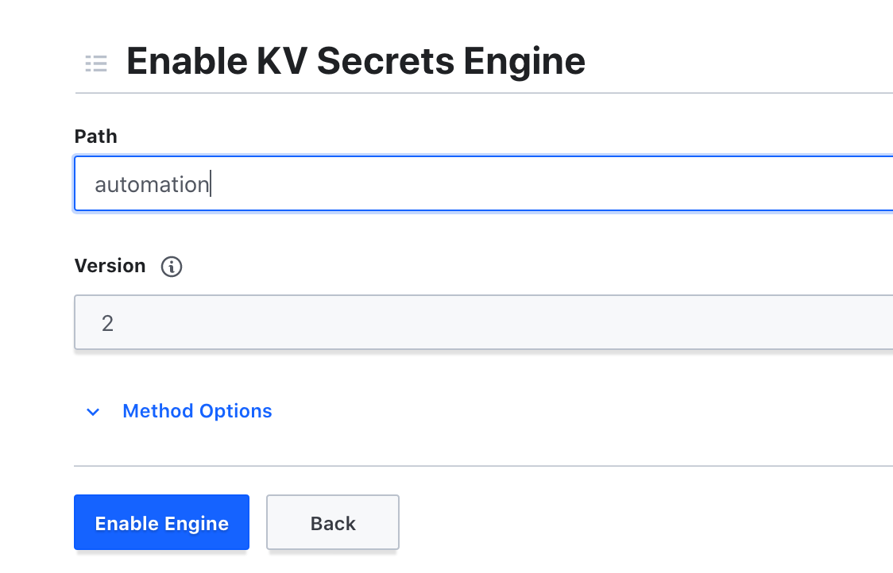
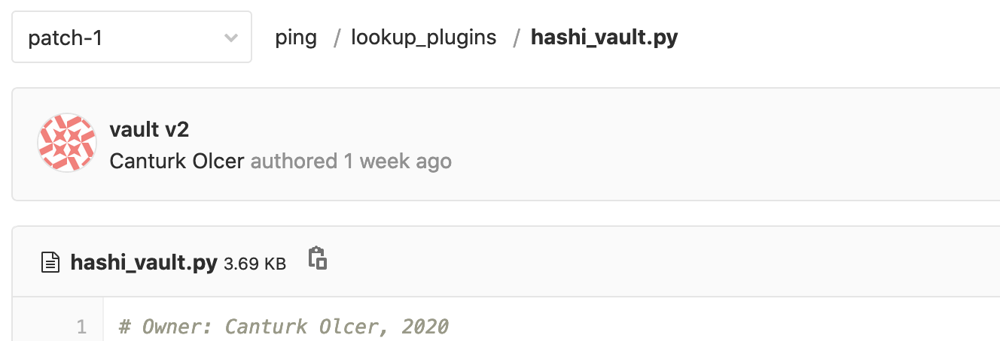

# HashiCorpVaultDeploymentonOCP4.3_and_TowerSetup

- [Introduction](#introduction)
- [Install HashiCorp Vault on Openshift 4.3](#install-hashicorp-vault-on-openshift-4.3)
- [Create Your First Vault](#create-your-first-vault)
- [Configure Tower to use HashiCorp Vault](#configure-tower-to-use-hashicorp-vault)

## Introduction
Installing Hashicorp Vault on Openshift 4.3

In this document, there are steps applied to install HashiCorp Vault on Openshift 4.3 and configure Ansible Tower to use HashiCorp Vault to authenticate endpoints.
** Standard Ansible Hashicorp plugin could not be used because we are using in-house created image which does not have HVAC module installed

References:<br>
https://learn.hashicorp.com/tutorials/vault/kubernetes-openshift<br>
https://www.vaultproject.io/docs/platform/k8s/helm/examples/standalone-audit<br>
https://www.vaultproject.io/docs/configuration/storage/filesystem<br>


Topology:

* Openshift version 4.3
* Ansible Tower 3.7 with ansible 2.9.9
* Gitlab Server

<br>

## Install HashiCorp Vault on Openshift 4.3

1. Create values.yaml file.

  ```
  % cat values.yaml
USER-SUPPLIED VALUES:
global:
  openshift: true

server:
  standalone:
    enabled: '-'
    config: |
      ui = true
      listener "tcp" {
        tls_disable = 1
        address = "[::]:8200"
        cluster_address = "[::]:8201"
      }
      storage "file" {
        path = "/vault/data"
      }

  service:
    enabled: true

  dataStorage:
    enabled: true
    size: 10Gi
    storageClass: ocs-storagecluster-cephfs
    accessMode: ReadWriteOnce

  auditStorage:
    enabled: true
    size: 10Gi
    storageClass: ocs-storagecluster-cephfs
    accessMode: ReadWriteOnce

  ```

2. Add HELM repo

  ```
  % helm repo add hashicorp https://helm.releases.hashicorp.com
  "hashicorp" has been added to your repositories
  ```

3. Create a new namespace on Openshift and switch to that project

  ```
  % oc create namespace hashicorp
    namespace/hashicorp created
  % oc project hashicorp
    Now using project "hashicorp" on server "https://<ocpip>:6443".
  ```
4. Install HashiCorp Vault using helm.

  ```
  % helm install vault hashicorp/vault --values values.yaml
  NAME: vault
  LAST DEPLOYED: Mon Oct 26 13:46:38 2020
  NAMESPACE: hashicorp
  STATUS: deployed
  REVISION: 1
  TEST SUITE: None
  NOTES:
  Thank you for installing HashiCorp Vault!

  Now that you have deployed Vault, you should look over the docs on using
  Vault with Kubernetes available here:

  https://www.vaultproject.io/docs/


  Your release is named vault. To learn more about the release, try:

    $ helm status vault
    $ helm get vault

  ```

5. Verify pods are running good.

  ```
    % oc get pods
    NAME                                    READY   STATUS    RESTARTS   AGE
    vault-0                                 1/1     Running   0          75s
    vault-agent-injector-8557bfb584-jfsph   1/1     Running   0          75s

    % oc get pvc
    NAME            STATUS   VOLUME                                     CAPACITY   ACCESS MODES   STORAGECLASS                AGE
    audit-vault-0   Bound    pvc-f8f3a027-747b-4735-b426-86b9d9938948   10Gi       RWO            ocs-storagecluster-cephfs   2m50s
    data-vault-0    Bound    pvc-c25427ed-f421-4e04-a456-4a25cc8625ab   10Gi       RWO            ocs-storagecluster-cephfs   2m50s

    % oc get route
    NAME    HOST/PORT                                   PATH   SERVICES   PORT   TERMINATION     WILDCARD
    vault   hashicorp.apps.<OCPDomainPrefix>.<BaseDomain>          vault      http   edge/Redirect   None

  ```

6. Login to webui and unseal the db. Do not forget to store your initial root token

7. <Optional> Create a new token for ansible access

  ```
  $ vault token create -tls-skip-verify
  Key                  Value
  ---                  -----
  token                <TOKEN>
  token_accessor       <TOKEN ACCESSOR>
  token_duration       ∞
  token_renewable      false
  token_policies       ["root"]
  identity_policies    []
  policies             ["root"]
  ```

## Create Your First Vault

1. Login to Vault Web UI using your root token.

2. Click "Enable New Engine" and pick KV and name it. Do not change version, it can stay at version 2.



3. To create a new password pair, create a payload.json file.

  payload.json:
  ```
  % cat payload_sample.json
  {
    "options": {},
    "data": {
      "username": "automationUser",
      "password": "secretPassword"
    }
  }
  ```

4. Use curl to create password

  ```
  % curl -k -H "X-Vault-Token: <TOKEN>" \
  -H "X-Vault-Request: true" \
  -H "Content-Type: application/json" \
  -X POST \
  -d @payload_sample.json \
  https://<HASHICOPRVAULT_URL>/v1/<KV ENGINED CREATED AT 2>/<ANY PATH YOU DESIRE>/<HOSTNAME>
  {"request_id":"a30df190-8539-522a-8d3b-b2446a31cdbf","lease_id":"","renewable":false,"lease_duration":0,"data":{"created_time":"2020-10-26T13:21:29.347316964Z","deletion_time":"","destroyed":false,"version":1},"wrap_info":null,"warnings":null,"auth":null}
  ```

5. Use query password using API

  ```
  %  curl -k -H "X-Vault-Token: <TOKEN>" \
  -H "X-Vault-Request: true" \
  -H "Content-Type: application/json" \
  -X GET \
  https://<HASHICOPRVAULT_URL>/v1/<KV ENGINED CREATED AT 2>/<ANY PATH YOU DESIRE>/<HOSTNAME>
  {"request_id":"551a52a8-c315-d8f8-7ac4-55f55bf280b5","lease_id":"","renewable":false,"lease_duration":0,"data":{"data":{"password":"secretPassword","username":"automationUser"},"metadata":{"created_time":"2020-10-26T13:32:56.037960298Z","deletion_time":"","destroyed":false,"version":1}},"wrap_info":null,"warnings":null,"auth":null}

  ```
## Configure Tower to use HashiCorp Vault

1. Copy and Paste hashi_vault.py under lookup_plugins folder under your repository



<a href="files/hashi_vault.py"> hashi_vault.py </a>

2. Define "ansible_password" variable in your variables. Best way will be using a group for vault lookup but it may change according to the infrastructure.

  Variable assignment:
  ```
  ansible_password: |-
    {{ lookup("hashi_vault", {
              "url" : "https://<HASHICOPRVAULT_URL>/v1/<KV ENGINED CREATED AT 2>/<ANY PATH YOU DESIRE>/{{ inventory_hostname }}",
              "token" : "<TOKEN>"} ) }}
  ```
